# hse_hw1_meth
https://colab.research.google.com/drive/10p2Cl654V4QIH0AIC-N_-KPiPdcWW765?usp=sharing

## Часть 1

| Bisulfite | RNA |
| :-: | :-: |
| 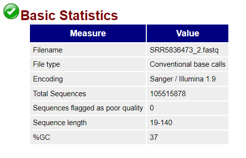 | 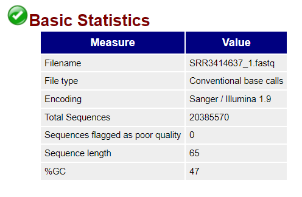 | 
| 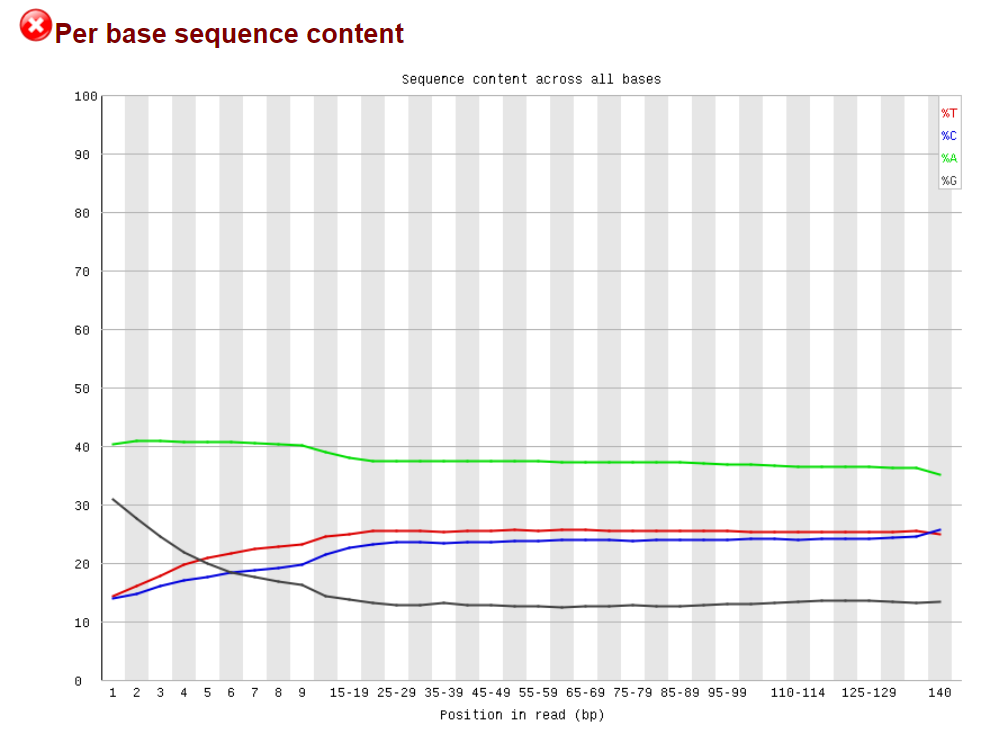 | 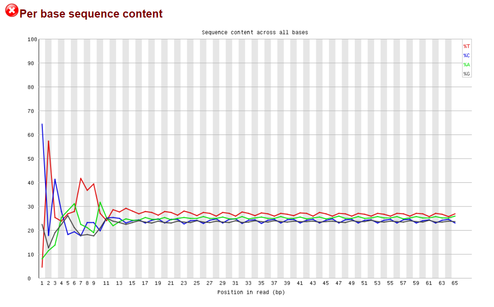 | 
| 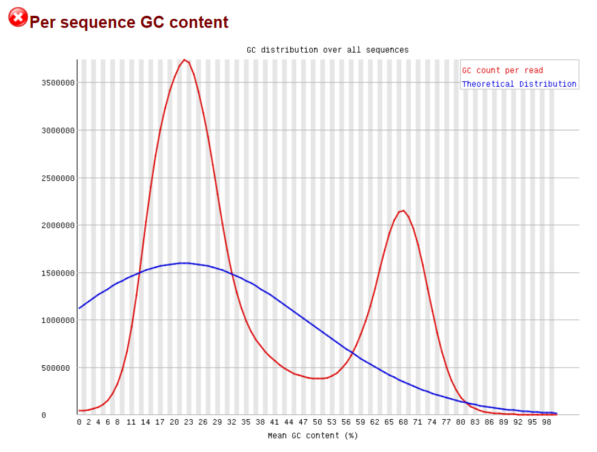 | 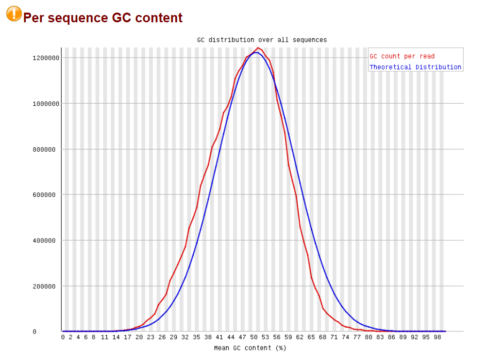 | 
| 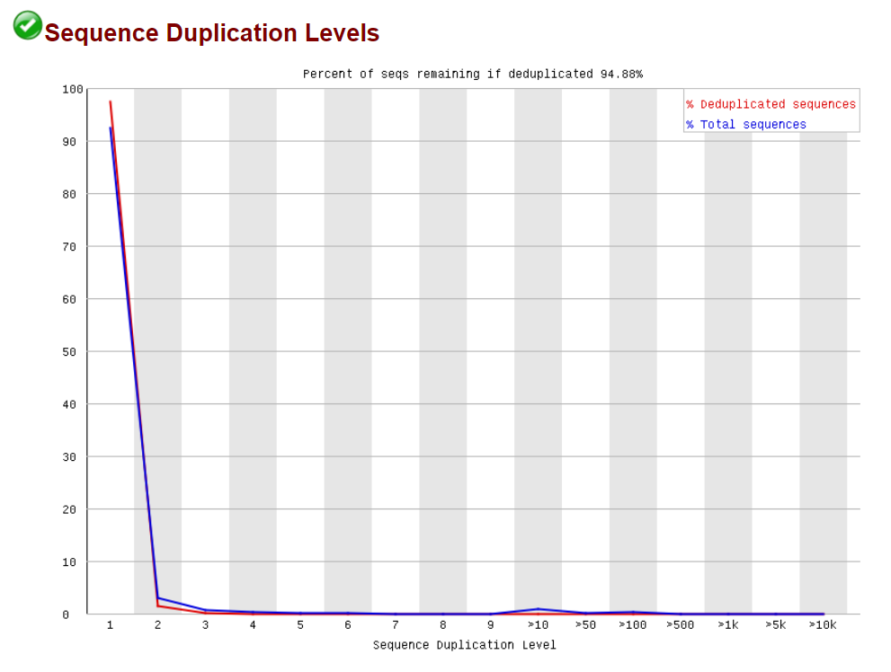 | 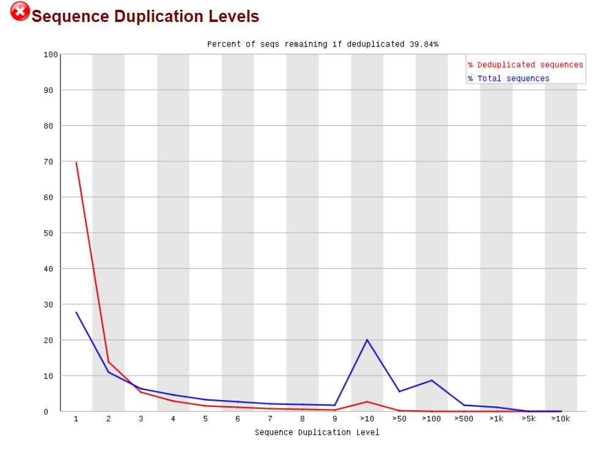 | 


## Часть 2

### Количество ридов, пришедшихся на целевые регионы, и число дуплицированных чтений

| Образец | 11347700-11367700 | 40185800-40195800 | % дупликаций |
| :----- | :-: | :-: | :-: |
| 8 Cell | 1090 | 464 | 18.31% |
| Epiblast | 2328 | 1062 | 2.92% |
| ICM | 1456 | 630 | 9.08% |


### Скрипт для параллельной дедупликации

```
!ls *pe.bam | xargs -P 4 -tI{} deduplicate_bismark  --bam  --paired  -o s_{} {}
```

### M-bias plot
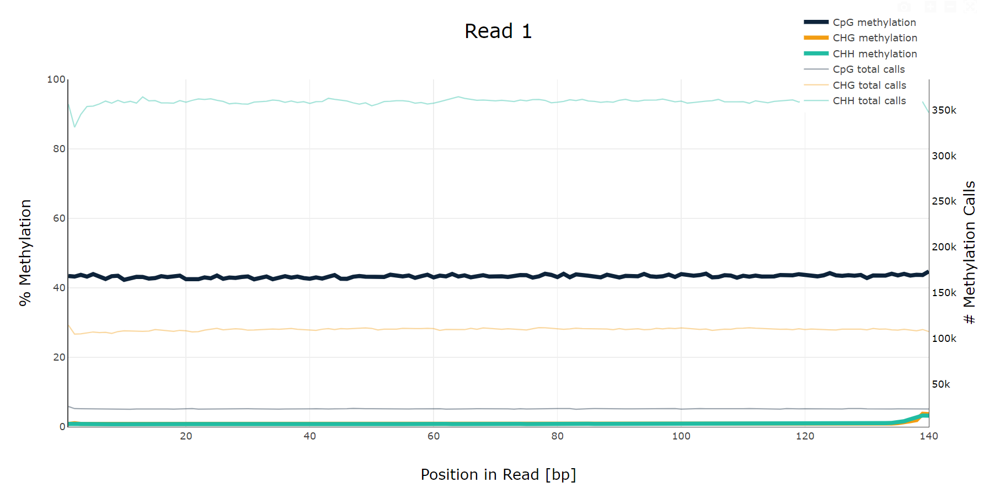
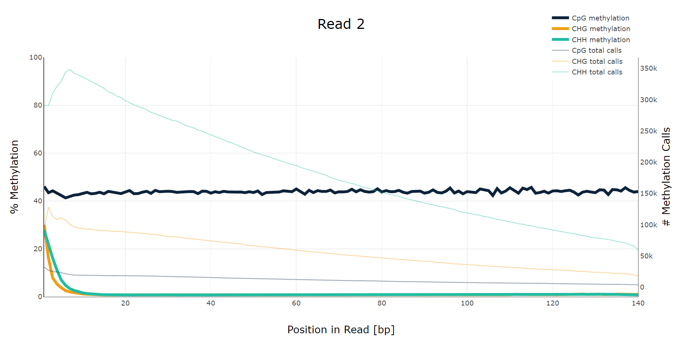

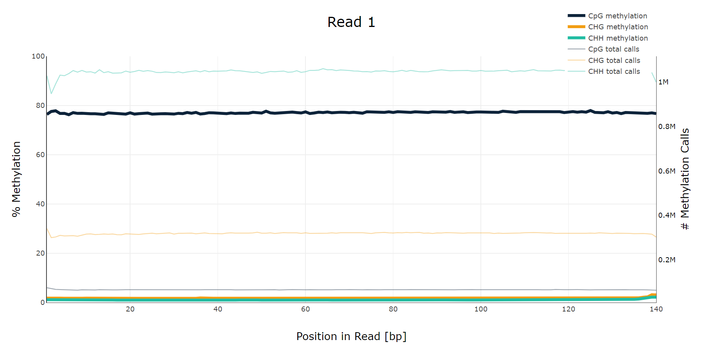
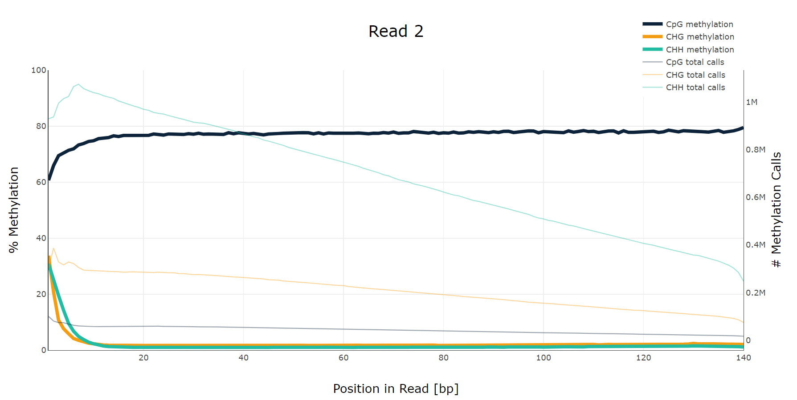


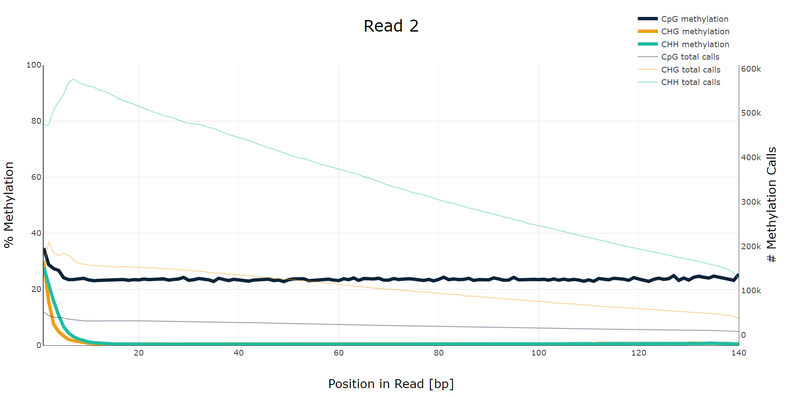

### Гистограммы уровня метилирования

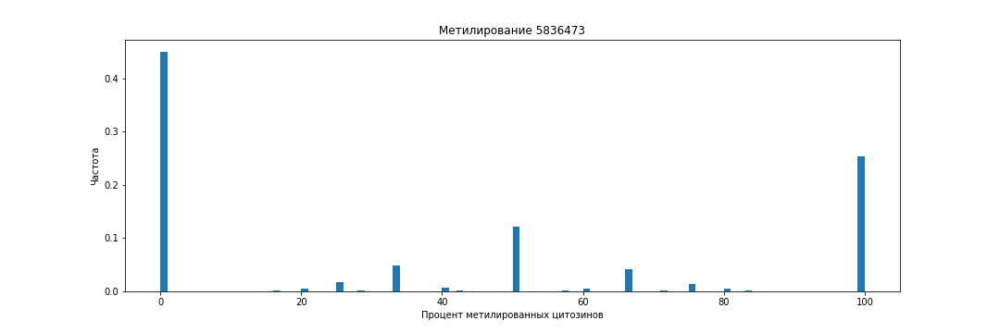
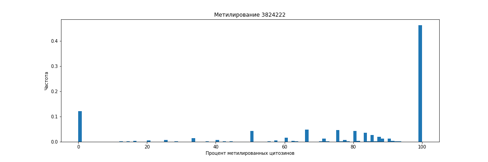
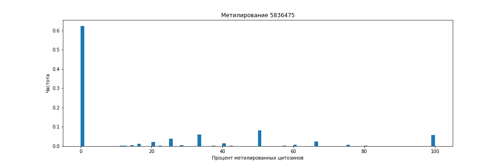

### Визуализация уровня метилирования и покрытия

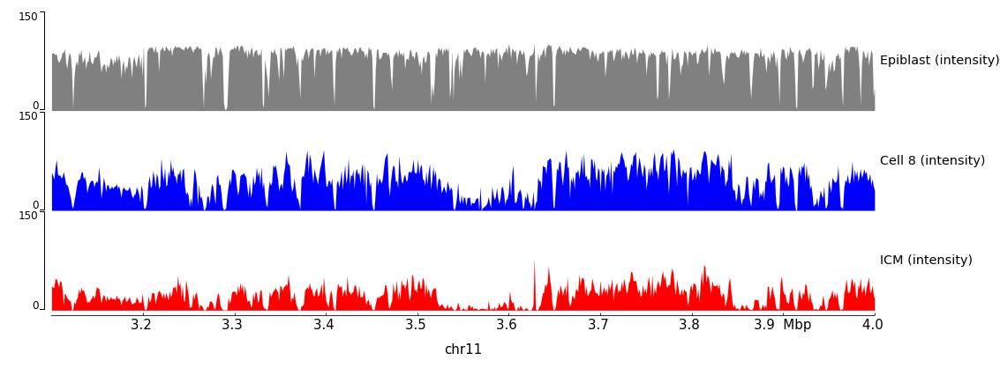
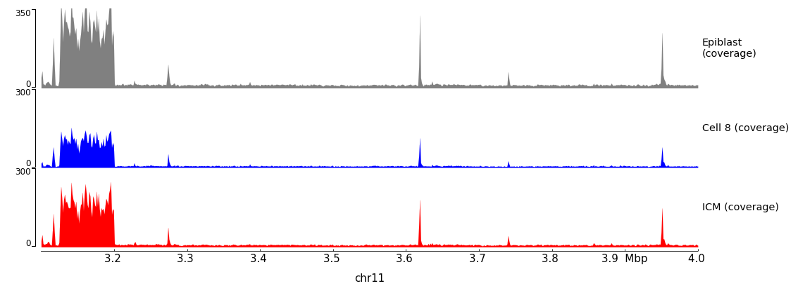
